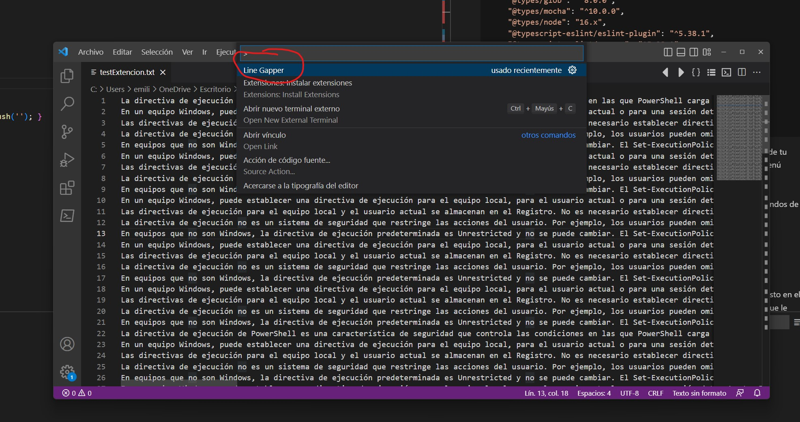
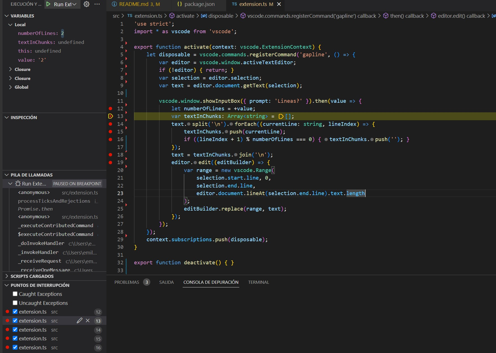
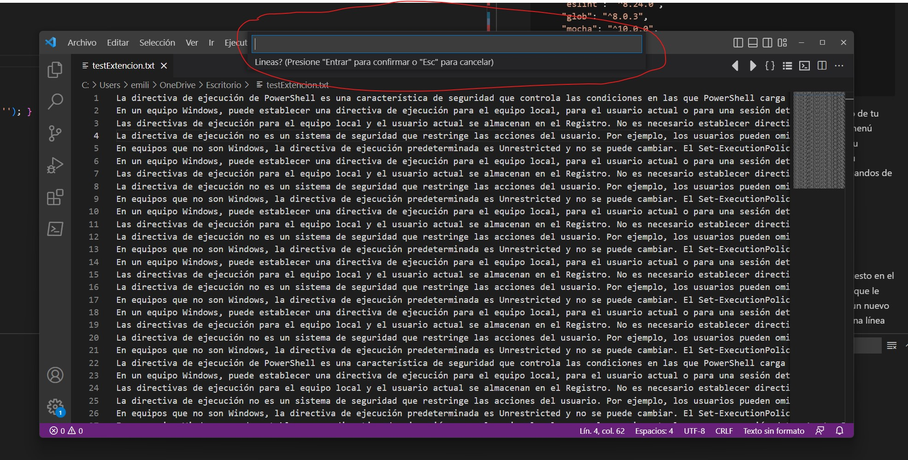
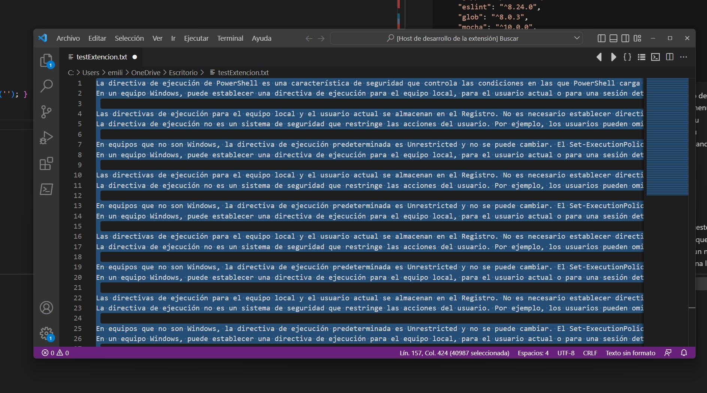

#### Emilio Martin Rodriguez Torres
##### 22/11/2022


## Computación en el cliente Web

### Creación de una extensión para Visual Studio Code

**Ejercicio inicial:**

1.   Comenta cada línea del código anterior teniendo en cuenta el propósito descrito al principio de este enunciado.

```typescript
//Se configura el compilador de de TypeScript para obligar a respetar reglas especifícas de tipado y getion de tipos.
'use strict';
//importa todo el modulo (*) 'vscode' y le coloca el alias vscode
import * as vscode from 'vscode';

/*Este método se llama cuando sucede un evento de activación de la extensión esta se activa cuando se ejecuta por primera vez el comando gapline*/
export function activate(context: vscode.ExtensionContext) {
	/*Se crea una variable con el nombre 'disposable' que contendrá la definición de nuestra extensión después se agrega el identificador único 'gapline' (configurado en el archivo package.json) a la lista de ocmandos disponibles con ese id, la función del se invocará cada vez que el comando 'gapline' se ejecute, ya sea mediante programación con executeCommand, o desde la interfaz de usuario de VS Code o mediante una combinación de teclas*/
	let disposable = vscode.commands.registerCommand('gapline', () => {
		/*Se obtiene la instancia del editor de texto activo al momento de ejecutar la extensión y se almacena en una variable (editor) para poder ser manipulada*/
		var editor = vscode.window.activeTextEditor;
		/*Se comprueba si el editor de texto existe, si la variable es undefined quiere decir que no se puedo obtener la instancia del editor (no esta abirto el editor) y por ende no se puede continuar, la ejecución termina con un retorno sin ejecutar nada mas*/
		if (!editor) { return; }
		/*Se guarda la referencia la propiedad selection del editor de texto en la variable 'selection'*/
		var selection = editor.selection;
		/*Se obtiene el texto seleccionado del editor activo de la variable selection y se guarda en la variable 'text'*/
		var text = editor.document.getText(selection);
		/*Se lanza un cuadro de dialogo para que el usuario ingrese algún valor, se le manda como parámetro un objeto (de tipo InputBoxOptions) key, value con las propiedades de configuración, en este caso el valor que queremos que aparezca en el prompt, si el cuadro de dialogo es cancelado (SCAPE) devuelve undefined de lo contrario devuelve el valor en cadena que ingreso el usuario (enter)*/
		vscode.window.showInputBox({ prompt: 'Lineas?' }).then(value => {
			/*Se recupera el valor capturado por el usuario (value) como es un dato de tipo string se coviente en number con operador unario +, si el valor es 
            diferente a un número devolverá NaN*/
			let numberOfLines = +value;
			/*Se declara un arreglo (textInChunks) de tipo string de una dimensión y vacío*/
			var textInChunks: Array<string> = [];
			/*El texto seleccionado se divide por cada salto de linea (/n) y se almacena en un arreglo con la funcion split para después recorrer el arreglo y obtener en cada iteracion el valor guardado "currentLine" y su indice "lineIndex" dentro del arreglo*/
			text.split('\n').forEach((currentLine: string, lineIndex) => {
				/*Se almacena la línea obtenida en la iteración (currentLine) en el arreglo 'textInChunks'*/
				textInChunks.push(currentLine);
				/*Se valida si es necesario agregar el salto de linea segun el valor ingresado por el usuario (numberOfLines) verificando el residuo entre el número de renglón + 1 (se suma uno por que los inidces inician en 0) y el número de filas capturado por el usuario si da 0 entoces es el momento de insertar en el arreglo (textInChunks) un nuevo registro vacio esto garantiza que queden bloques según el numero de lianas que configuro el usuario en la entrada de texto*/
				if ((lineIndex+1) % numberOfLines === 0) {textInChunks.push('');}
            });
			/*A la variable text se le asigna la cadena obtenida por de la union de todos los valores de arreglo textInChunks pero entre cada valor se agrega un caracter salto de linea*/
			text = textInChunks.join('\n');
			/*Se inicia la edición del editor de texto para mostrar el texto formateado*/
			editor.edit((editBuilder) => {
				/*Se crea una instancia de de tipo range donde se define un rango en el editor donde se indica la línea donde se inicia el rango en este caso será la primera línea de la selección de texto del usuario, después se define el primer carácter que tomara que en este caso será el primer carácte de la línea de selección del usuario, después se define la ultima línea del rango que este caso será la última línea de la selección del usuario y al final se define el ultimo carácter que tomara en este caso será el último carácter de la última línea de la selección del usuario*/
				var range = new vscode.Range(
					//Se configura el número inicial de la linea
                    selection.start.line, 
                    //Se configura el número inicial de la columna
                    0,
                    //Se configura el número final de la linea
					selection.end.line,
                    //Se configura el número final de la columna
					editor.document.lineAt(selection.end.line).text.length
				);
				/*después se define remplazar todo lo que este en el rango definido anteriormente por el arreglo que ya está formateado (contiene los
                espacios cada cierto número de líneas)*/
				editBuilder.replace(range, text);
			});
		});
	});
	/*Se subscribe a una lista de objetos que se puede desechar, esta subscrpcion garantiza la correcta limpieza que hace automaticamente VS Code, recordemos que "vscode.commands.registerCommand" devuelve un objeto desechable (disposable) para un mejor manejo de recursos */
	context.subscriptions.push(disposable);
}

/*Este método se llama cuando su extensión se desactivada, en este ejercicio no se requiere funcionalidad en este evento*/
export function deactivate() {}

```
2.  Busca en el API de las extensiones de VS Code (https://code.visualstudio.com/api/references/vscode-api) y averigua para qué sirve las funciones activate, deactivate y el resto de funciones y propiedades específicas de las extensiones de VS Code.
    1.  `activate`
        *   Funcion default que recive como parametro el contexto de eventos en los que su extensión se activa
    2.  `vscode.commands.registerCommand`
        *   Este vincula un identificador de comando a una función manegadora de la extensión
    3.  `vscode.window.activeTextEditor`
        *   Manejador dell editor actualmente activo o undefined. El editor activo es el que actualmente tiene el foco o, cuando ninguno lo tiene, el que ha cambiado de entrada más recientemente.
    4.  `vscode.window.activeTextEditor.document.getText`
        *   Obtiene el texto del documento en el editor de texto activo. Una subcadena se puede recuperar proporcionando un rango.
    5.  `vscode.window.showInputBox`
        *   Abre un cuadro de entrada para pedirle al usuario que ingrese. El valor devuelto será undefinedsi se canceló el cuadro de entrada (por ejemplo, presionando ESC). De lo contrario, el valor devuelto será la cadena escrita por el usuario o una cadena vacía si el usuario no escribió nada pero desechó el cuadro de entrada con Aceptar.
    6.  `vscode.window.activeTextEditor.edit`
        *   Realice una edición en el documento asociado con este editor de texto. La función se invoca con un generador de edición que debe usarse para realizar ediciones. 
    7.  `vscode.Range`
        *   Un rango representa un par ordenado de dos posiciones. Los objetos de rango son inmutables 
    8.  `context.subscriptions.push`
        *   Una matriz a la que se pueden agregar desechables (disposable). Cuando se desactive esta extensión, se desecharán los desechables.
    9.  `deactivate`
        *   Funcion default que se ejecuta cunado la extencion se desactiva.

3.  Es importante que entiendas cada línea de código. Si tienes alguna dificultad, puedes preguntar en el foro ad hoc para la resolución del ejercicio. ¿Qué elementos específicos de TypeScript identificas? Recuerda que el profesor está para ayudarte y que esta ayuda continua en el foro.

    *  En TypeScript, al igual que en ECMAScript 2015, cualquier archivo que contenga un nivel superior importo exportse considera un módulo. Por el contrario, un archivo sin ningún nivel superior importo exportdeclaraciones se trata como un script cuyo contenido está disponible en el ámbito global (y, por lo tanto, también para los módulos). `import`, `export`

**Segundo ejercicio:**

1.  Comprueba que tu extensión funciona. Para ello, primero asegúrate de que sustituyes todos los sayHello (que inserta por defecto el generador code que hemos aplicado con Yeoman) por el nombre de la función que hemos usado (gapline en nuestro caso) en el fichero package.json. Como hemos comentado antes, este fichero contiene las opciones e información básica de nuestra extensión y, entre otras cosas, cómo ejecutarla. Es especialmente importante las secciones activationEvents y commands. Vigila que el nombre del comando sea el correcto. 

```typescript
{
  "name": "gapline",
  "displayName": "Line Gapper",
  "description": "Creacion de una extencion para visual studio code",
  "version": "0.0.1",
  "engines": {
    "vscode": "^1.72.0"
  },
  "categories": [
    "Other"
  ],
  "activationEvents": [
    "onCommand:gapline"
  ],
  "main": "./out/extension.js",
  "contributes": {
    "commands": [
      {
        "command": "gapline",
        "title": "Line Gapper"
      }
    ]
  },
  "scripts": {
    "vscode:prepublish": "npm run compile",
    "compile": "tsc -p ./",
    "watch": "tsc -watch -p ./",
    "pretest": "npm run compile && npm run lint",
    "lint": "eslint src --ext ts",
    "test": "node ./out/test/runTest.js"
  },
  "devDependencies": {
    "@types/vscode": "^1.72.0",
    "@types/glob": "^8.0.0",
    "@types/mocha": "^10.0.0",
    "@types/node": "16.x",
    "@typescript-eslint/eslint-plugin": "^5.38.1",
    "@typescript-eslint/parser": "^5.38.1",
    "eslint": "^8.24.0",
    "glob": "^8.0.3",
    "mocha": "^10.0.0",
    "typescript": "^4.8.4",
    "@vscode/test-electron": "^2.1.5"
  }
}
```

2.  Para ejecutar la extensión, pulsa F5 (o la tecla función + F5, dependiendo de tu teclado y sistema) o selecciona la opción de menú Start debugging del menú Debug. Verás que se abre una nueva ventana de VS Code (que ya tiene tu extensión precargada). Abre un fichero de texto cualquiera, selecciona su contenido y pulsa control/comando + shift + P. Se abrirá el visor de comandos de VS Code, el command palette:




3.  Busca el nombre de tu extensión (tendrá el mismo nombre que hayas puesto en el campo contributes -> commands -> title en el fichero package.json o el que le diste cuando la creaste con el generador de Yeoman). Debería aparecer un nuevo cuadro de diálogo preguntándote cada cuántas líneas quieres insertar: una línea en blanco (o el texto que hayas puesto en la propiedad prompt del código anterior). Selecciona un número apropiado y pulsa intro. Verás cómo el texto seleccionado es sustituido por uno nuevo, pero que contiene líneas en blanco.



